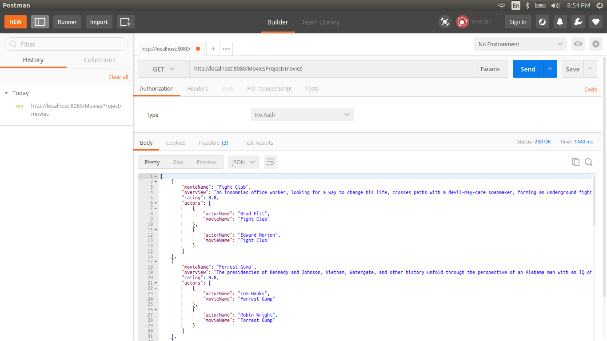

# Spring Rest service example

This example shows how to build a Restful Web service using Spring. Spring Jdbc is used for dealing with the SQL queries. 

## Requirements
- Eclipse IDE is preferred
- Mysql Database
- Postman Rest Client
- Jackson for JSON data binding

## Usage 
Clone the repository. Create the required tables in Mysql and add some records into it. Open Postman and fire up the requests with the appropriate url. This example is able to handle these requests
```
GET /movies - Retrieve all Movies 
```
```
GET /movies/{name} - Retreive a specific movie
```
```
GET /actors - Retreive all Actors 
```
```
GET /actors/{name} - Retrieve an actor with his/her movies 
```
```
POST /movies/{name} - Save a movie 
```
```
DELETE /movies/{name} - Delete a specific movie 
```
I've added some screenshots for reference. Refer the screenshots folder for more.

## Screenshots
Mysql tables 


Postman 



## Contributions
Contributions are always welcome. Fork the repostiory and contribute back through pull requests.
